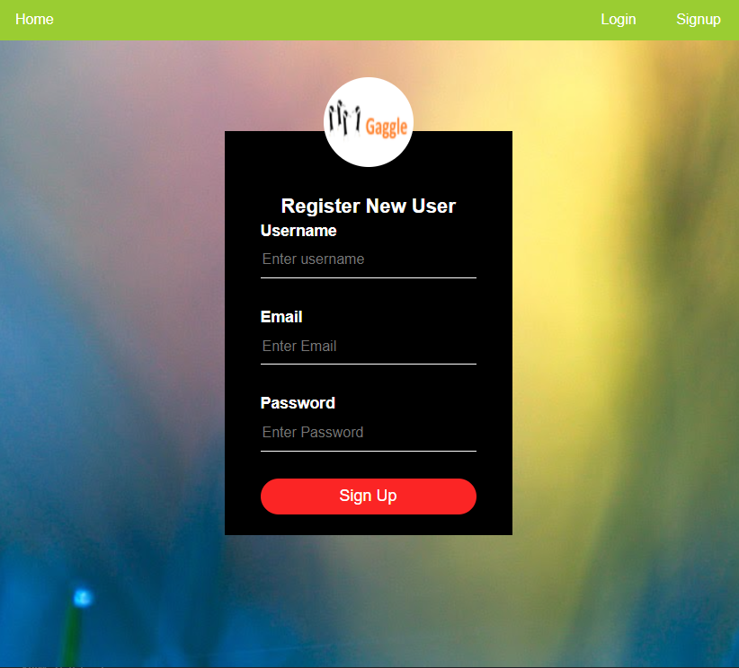

# Gaggle
.png)
## License
  [](https://opensource.org/licenses/MIT)
  [](https://docs.npmjs.com/policies/npm-license)

## Table of Contents

[Description](#description)

[Deployment](#deployment)

[Technology Used](#technology-used)

[Installation Packages](#installation)

[Test](#test)

[Screenshot](#screenshot)

[Contributors](#contributors)

## Description


Gaggle is a web application that enables users to have conversations with other users. After a simple sign-up process, users may engage in a gaggle(chat) with other users in one of the flock (conversations). If you have already signed-up, you may simply just log-in and get involved. 

Active users are displayed on the main page and the user with the highest contributions are marked as "Top Contributor". 

Users may choose to enter a "Discussion Room" of choice and start conversations with other users. Currently, users are unable to create their own discussions, but that will be introduced with new updates in the future. Please check back for more! 

## Technology Used
Gaggle was made using: 
- Node JS 
- Express JS 
- MySQL 
- NPM Packages
- Chart JS
- Handlebars JS 
- CSS 

## Deployment

Website is currently deployed on Heroku. 

Deployed Link: gaggle is no longer deployed here due to security reasons! Contact Joe for new deployed link!

Github Repo: [Gaggle Repo](https://github.com/jollypong/Gaggle)

## Installation
  ** Only required if wanting to test or contribute.  

  For Installation, you are required the following:
  - Node JS 
  - MySQL 
  
  Additional packages required are: 
  - Node Packet Manager(NPM):
    - NPM [dotenv](https://www.npmjs.com/package/dotenv)
    - NPM [express](https://www.npmjs.com/package/express)
    - NPM [mySQL2](https://www.npmjs.com/package/mysql2)
    - NPM [require](https://www.npmjs.com/package/require)
    - NPM [sequelize](https://www.npmjs.com/package/sequelize)

  You can install the above required packages by entering following on the terminal/node:
  ```
    npm install
  ```
## Test
No testing was done for this project. 

However, please feel free to add the feature to contribute to this project or contact me for more details!

## Future Development 
- Refine front end design 

- Include Socket IO for TCP/IP connection 

- Features to add: 
  - include profile page and ability to assign profile images
  - Include "make flock" (create conversation lobby)
  - Include "gaggle timer" where it shows how long a conversation has been open for
  - Include "destory flock" (delete conversation lobby)
  - Include "auto-destory function" to destroy flock if hasn't been active for a period of time. 
  - Include "gaggle gaggle" (create invite links) 
  - Include edit/delete function to messages
  - Support images and emojis in chat
  - Include section displaying online users
  - Testing

## Screenshot





## Contribution

    Gaggle Dev 2022

    Front End Team: 
     - Shaleen Shaji
     - Abi Lalu

    Back End Team: 
     - Travis Anderson
     - Joe Lee

    Got any questions or want to contribute to this project? 

Gaggle Dev 2022's Github Links: 

  - Joe Lee [Jollypong](https//:github.com/Jollypong) 
  - Travis Anderson [Travis-Anderson023](https://github.com/Travis-Anderson023)
  - Shaleen Shaji [Shaleens1994](https://github.com/Shaleens1994)
  - Abi Lalu [abilalu](https://github.com/abilalu)

## 
